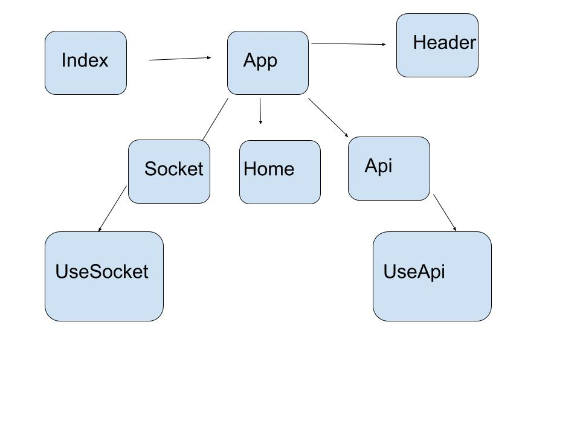

# LAB - 23

### Author: Student/Group Name

### Links and Resources
* [submission PR](https://github.com/morgan-401-advanced-javascript/Lab23App/pull/1)
* [travis](https://travis-ci.com/morgan-401-advanced-javascript/Lab23App)
* [back-end](https://github.com/morgan-401-advanced-javascript/lab23Server) Server Repo
* [Netlify](https://csb-mqvge.netlify.com/) 
* [Sandbox](https://codesandbox.io/s/black-sunset-mqvge) 

### Setup
#### `.env` requirements
* `PORT` - 3005

#### Running the app
Locally:
1. Clone the Server - [back-end](https://github.com/morgan-401-advanced-javascript/lab23Server)
* `npm start`
2. Clone the App - [submission PR](https://github.com/morgan-401-advanced-javascript/Lab23App/pull/1)
Ensure that the `socket.js` line 7-8 server url is up to date
* `npm start`

  
#### Tests
* How do you run tests?
`npm test`
* Could not add coverage & verbose to travis due to a handlebars version issue.

#### UML
